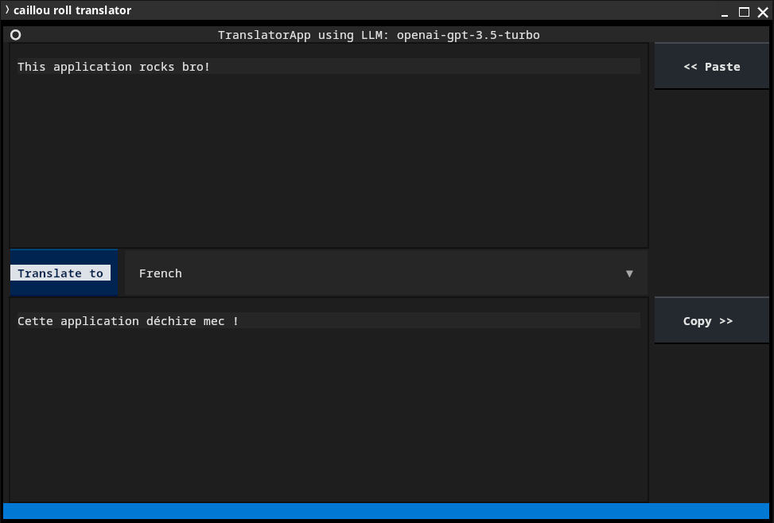

[](https://github.com/sdudoit/caillou/actions/workflows/ci.yml)

# Caillou

Caillou is a project to explore AI technologies (e.g. LLMs, LangChain etc.) by implementing some utilities for the terminal

## Roadmap

Some topics to explore:

- [x] Use an LLM to translate a text to another language
- [x] Allow to use a local LLM to guaranty privacy and free of charge LLM usage
- [ ] Use an LLM to generate an answer by using the content of local documents 
- [ ] Use an LLM to generate an answer by using a function or tool

etc.

## Install

You can install the application the following command:

```bash
pip install caillou
```

## Requirements

### Using OpenAI LLM

In order to use the application with an OpenAI LLM, you need to provide an API key defined as an environment variable `OPENAI_API_KEY`.

N.B. This API key can also be defined directly in the configuration file created after the first execution (e.g. on Linux: `$HOME/.config/caillou/config.json`)

### Using local LLM

In order to use the application with a local LLM, you need to:

* Install [Ollama](https://ollama.com/)
* Install the desired LLM (e.g. "llama3", "mistral" etc.) with Ollama
* Adapt the configuration file created after the first execution (e.g. on Linux: `$HOME/.config/caillou/config.json`)

## Features

### Translate one line

Using the `translate` command, you can quickly translate a sentence:

```bash
$ caillou translate FR This app rocks bro!
Cette application déchire mec !

(Generated with LLM: openai-gpt-3.5-turbo)
```

### Roll an application

Using the `roll` command, you can list included applications:

```bash
$ caillou roll
Here is a list of available applications:
 - translator
```

and launch one of them:

```bash
$ caillou roll translator
```




